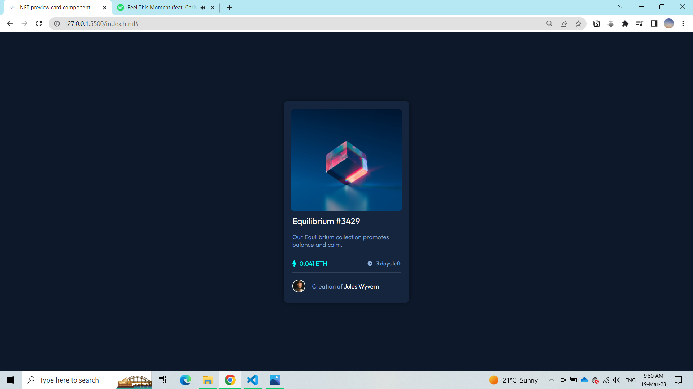

# Frontend Mentor - NFT preview card component solution

This is a solution to the [NFT preview card component challenge on Frontend Mentor](https://www.frontendmentor.io/challenges/nft-preview-card-component-SbdUL_w0U).

This challenge is solved by Mahendra Dani on 19th March 2023.

## Table of contents

- [Frontend Mentor - NFT preview card component solution](#frontend-mentor---nft-preview-card-component-solution)
  - [Table of contents](#table-of-contents)
  - [Overview](#overview)
    - [The challenge](#the-challenge)
    - [Screenshot](#screenshot)
    - [Links](#links)
  - [My process](#my-process)
    - [Built with](#built-with)
    - [What I learned](#what-i-learned)
    - [Continued development](#continued-development)
    - [Resources](#resources)
  - [Author](#author)

## Overview

### The challenge

Users should be able to:

- View the optimal layout depending on their device's screen size
- See hover states for interactive elements

### Screenshot

### Links

- Solution URL: [Add solution URL here](https://your-solution-url.com)
- Live Site URL: [Add live site URL here](https://your-live-site-url.com)

## My process

### Built with

- Semantic HTML5 markup
- CSS custom properties
- CSS Flexbox

### What I learned
- Positioning and alignment using CSS
- Developing `cards` using pure HTML and CSS
- Deeper understanding of CSS Flexbox
- Working with `svg` images

### Continued development
- Responsive webpage design
- More user friendly and high end UI development

### Resources

- [Google Fonts](https://fonts.google.com/) - This helped me to use the specified fonts in the challenge.
- [MDN Web Docs](https://developer.mozilla.org/en-US/) - This helped me fixing and recalling different CSS properties and their syntax errors.

## Author
- Website - [Mahendra Dani](https://mahendradani.github.io/Mahendra-Dani-s-Portfolio-Website/)
- LinkedIn - [Mahendra Dani's LinkedIn](https://linkedin.com/in/mahendra-dani)
